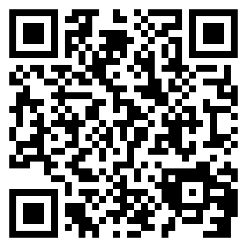

# Introduction

A few quick ground rules:

* If you need help, please raise your hand. The TAs and myself will be happy to help you.
* I'm deaf and my hearing aids really only pick up what's in front of me. So please let me know if someone needs help and I haven't noticed!
* We'll take breaks (TBD - get schedule)
* If you get stuck, there are Docker versions of all of the examples.

You can get everything in this presentation from:

# https://github.com/thebracket/RustNations2025

